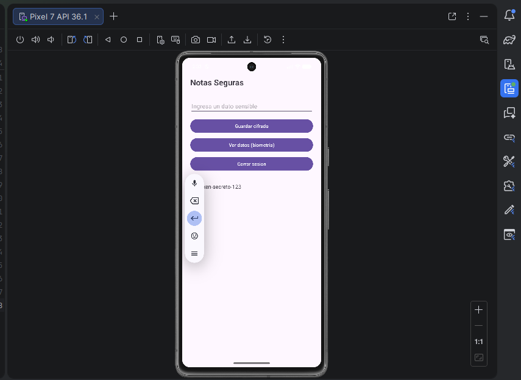
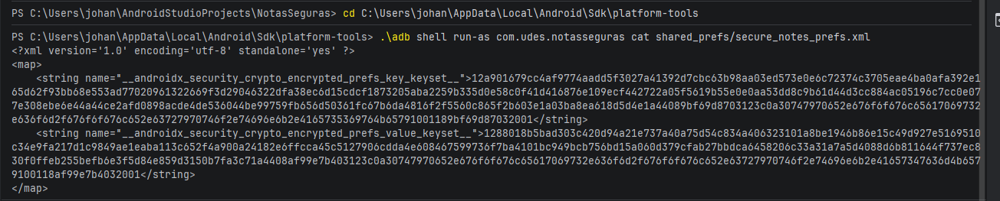
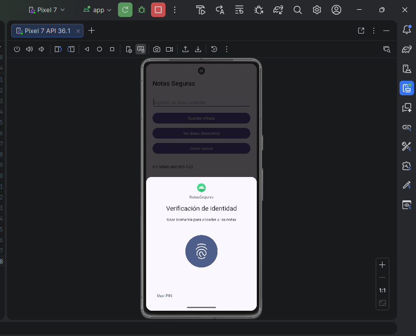
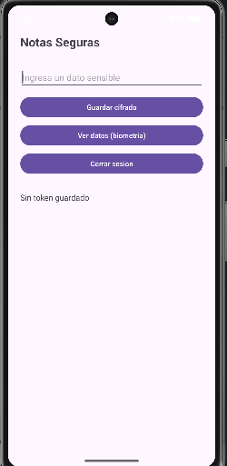

# Laboratorio: Módulo de Almacenamiento Seguro
Asignatura: Aplicaciones Móviles
Unidad: 6 — Seguridad Móvil y Protección de Información
Institución: Universidad de Santander (UDES)
Año: 2026

---

## Descripción del proyecto

Aplicación Android de notas personales que implementa almacenamiento seguro
mediante EncryptedSharedPreferences y Android Keystore, con autenticación
biométrica usando BiometricPrompt. El objetivo es garantizar que los datos
sensibles no sean accesibles en texto plano en ningún momento.

---

## Requisitos previos

- Android Studio Hedgehog (2023.1.1) o superior
- Emulador Android API 30+ o dispositivo físico con Android 11+
- Conocimiento básico de Kotlin, ViewModel y LiveData
- JDK 11 o superior

---

## Instalación y ejecución

1. Clona el repositorio:
   git clone https://github.com/Johan09CD/Carre-o-post1-u6-Apps

2. Abre el proyecto en Android Studio:
   File → Open → selecciona la carpeta del proyecto

3. Sincroniza las dependencias:
   Android Studio mostrará "Sync Now" → haz clic

4. Ejecuta la app:
   Selecciona un emulador API 30+ y presiona Run

---

## Dependencias utilizadas

androidx.security:security-crypto:1.1.0-alpha06
androidx.biometric:biometric:1.2.0-alpha05
androidx.lifecycle:lifecycle-viewmodel-ktx:2.7.0
androidx.lifecycle:lifecycle-livedata-ktx:2.7.0

---

## Estructura del proyecto

app/src/main/java/com/udes/notasseguras/
├── security/
│   ├── SecureStorageManager.kt
│   └── BiometricHelper.kt
├── viewmodel/
│   └── NotesViewModel.kt
└── MainActivity.kt

---

## Descripción de clases de seguridad

SecureStorageManager.kt
Clase singleton que centraliza todas las operaciones de almacenamiento seguro.
Encapsula la creación de la MasterKey con esquema AES256_GCM y las
EncryptedSharedPreferences con cifrado AES256_SIV para claves y AES256_GCM
para valores. El resto de la aplicación nunca interactúa directamente con
las APIs criptográficas.

Funciones principales:
- guardarToken(context, token): cifra y persiste el token de sesión
- obtenerToken(context): recupera y descifra el token
- guardarPin(context, pin): cifra y guarda el PIN del usuario
- verificarPin(context, pinIngresado): compara el PIN ingresado con el almacenado
- limpiarSesion(context): elimina el token de sesión del almacenamiento

BiometricHelper.kt
Clase singleton que gestiona la autenticación biométrica usando BiometricPrompt
de la librería androidx.biometric. Maneja huella dactilar y reconocimiento
facial de forma unificada. Verifica la disponibilidad de biometría fuerte
antes de autenticar.

Funciones principales:
- biometriaDisponible(context): verifica si el dispositivo soporta biometría fuerte
- autenticar(activity, onSuccess, onError): lanza el diálogo biométrico del sistema

NotesViewModel.kt
ViewModel que actúa como intermediario entre la UI y el SecureStorageManager.
Mantiene el estado de la sesión usando MutableLiveData y expone funciones
para guardar el token y cerrar sesión.

---

## Decisiones de diseño de seguridad

1. AES256-GCM como esquema de cifrado
   Se eligió MasterKey.KeyScheme.AES256_GCM por ser el estándar recomendado
   por Google para Android Keystore. GCM proporciona cifrado autenticado,
   garantizando confidencialidad e integridad de los datos.

2. Singleton para SecureStorageManager
   Se usó object de Kotlin para garantizar una única instancia en toda la app.
   Evita que múltiples instancias creen diferentes MasterKey o accedan a las
   preferencias de forma inconsistente.

3. Android Keystore como respaldo
   La MasterKey se almacena en el Android Keystore. La clave de cifrado nunca
   sale del chip de seguridad del dispositivo, protegiéndola incluso ante
   acceso root.

4. BiometricPrompt sobre APIs legacy
   Se usó androidx.biometric.BiometricPrompt en lugar de FingerprintManager
   (deprecado) porque maneja de forma unificada todos los métodos biométricos
   con el diálogo del sistema integrado.

5. Separación de responsabilidades
   La lógica de cifrado está en SecureStorageManager, la autenticación en
   BiometricHelper y el estado en NotesViewModel. Ninguna clase de UI accede
   directamente a las APIs criptográficas.

---

## Evidencias de checkpoints

### Checkpoint 1 — Cifrado verificado
Verificación con ADB de que secure_notes_prefs.xml no contiene el token
en texto plano.
  

### Checkpoint 2 — Autenticación biométrica funcional
El diálogo de BiometricPrompt se activa correctamente al intentar ver
datos sensibles. 

### Checkpoint 3 — Logout limpio verificado
Tras cerrar sesión la app muestra "Sin token guardado" confirmando que
el dato fue eliminado del almacenamiento seguro.
